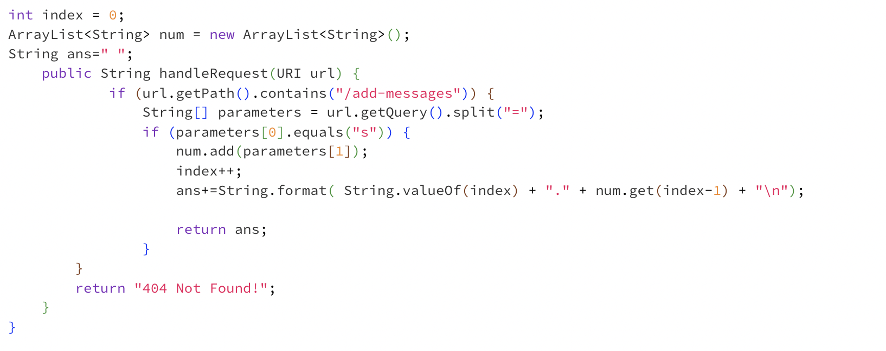

Lab Report 2

Part 1. 
Code for StringServer: 
Add-messages Screenshot:

1). Firstly, we would call the public static void main(String[] args) throws IOException method when we are activating the server. Then we call the method public String handleRequest(URI url) that takes in the url input and then proceeds to look for specific keywords such as "/", or "add" and then proceeds to change the output on the website.

2). In the first method, the method takes arguments of "String[]args"; which means an array of strings of Java string class, which means we can input several inputs because the array can store the inputs we put in the command line.

 Part 2.

 

Part 3. I didn't know we could do so much with terminal, and I didn't know that we could "login" to a school account or personal account on our own laptop. Furthermore, I think what fascinated me the most was the part where we focused on what different words in the URL address mean. I've always pondered what the lashes are for, or what each keyword means. Also, I think it was exciting that we explored why and how the URL is modified and what each command means. During the process, I encountered some issue with the server and I wasn't really familiar with javac and java commands, but after a few tries and getting helps from the TAs, now I fully understand the purpose of each command and how I am supposed to utilize it next time when I need to connect to a server and get a network website started.
